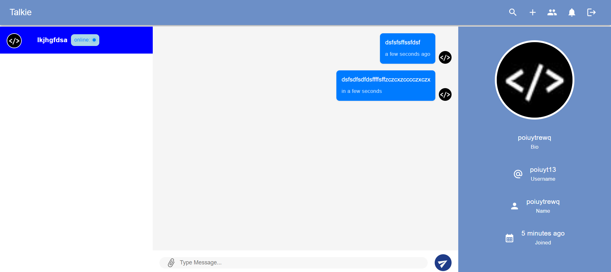
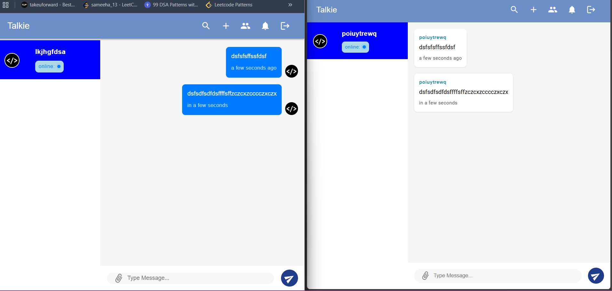
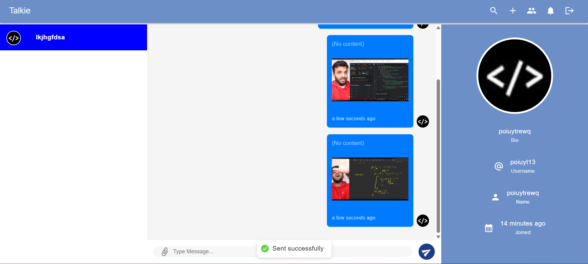
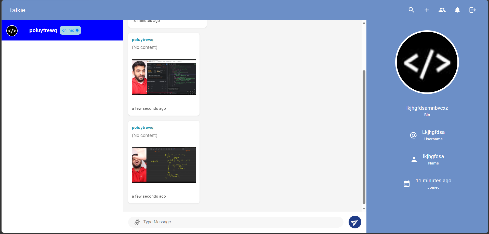

#  Real-Time Chat Application - Backend

[](https://nodejs.org/)
[](https://expressjs.com/)
[](https://mongodb.com/)
[](https://socket.io/)
[](LICENSE)

##  Overview

A robust, production-ready backend for a real-time chat application featuring one-on-one messaging, group chats, file sharing, and admin analytics. Built with Node.js, Express, MongoDB, and Socket.io for seamless real-time communication.

##  Live Demo

| Service | URL |
|---------|-----|
| **Backend API** | [https://real-time-chat-application-ky07.onrender.com](https://real-time-chat-application-ky07.onrender.com) |
| **Frontend App** | [https://real-time-chat-application-frontend-rho.vercel.app/login](https://real-time-chat-application-frontend-rho.vercel.app/login) |







##  Features

###  User Features
- **Authentication**: Secure JWT-based authentication with HTTP-only cookies
- **Profile Management**: Create account with avatar upload (Cloudinary)
- **Friend System**: Send/accept/reject friend requests
- **Real-time Messaging**: Instant message delivery with typing indicators
- **Read Receipts**: Message alerts for unread messages

###  Group Chat Features
- Create group chats (minimum 3 members)
- Add/remove group members
- Rename groups (creator only)
- Leave groups (non-creators)
- Delete groups (creator only)

###  Media & Files
- Upload images and files (max 5 files, 5MB each)
- Cloudinary integration for file storage
- Support for various file types

###  Real-time Events
- Online/offline user status
- Typing indicators
- New message alerts
- Friend request notifications
- Group activity updates

###  Admin Dashboard
- Secure admin login with secret key
- View all users with chat statistics
- View all chats with message counts
- View all messages across the platform
- Dashboard statistics with 7-day message chart
- Session expires in 15 minutes

##  Architecture
├── 📁 config/ # Configuration files (CORS, constants) <br>
├── 📁 controllers/ # Business logic handlers <br>
├── 📁 middlewares/ # Auth, error handling, multer, validation <br>
├── 📁 models/ # MongoDB schemas (User, Chat, Message, Request) <br>
├── 📁 routes/ # API endpoints (user, chat, admin) <br>
├── 📁 utils/ # Helper functions, Cloudinary, socket events <br>
├── 📁 constants/ # Event constants <br>
├── 📁 lib/ # Utility libraries <br>
├── 📁 seeders/ # Database seeding scripts  <br>
└── app.js # Application entry point <br>

##  API Endpoints

### Authentication & User Routes (`/api/v1/user`)

| Method | Endpoint | Description |
|--------|----------|-------------|
| POST | `/new` | Register new user |
| POST | `/login` | Login user |
| GET | `/me` | Get user profile |
| GET | `/logout` | Logout user |
| GET | `/search` | Search users |
| PUT | `/sendrequest` | Send friend request |
| PUT | `/acceptrequest` | Accept/reject friend request |
| GET | `/notifications` | Get all friend requests |
| GET | `/friends` | Get friends list |

### Chat Routes (`/api/v1/chat`)

| Method | Endpoint | Description |
|--------|----------|-------------|
| POST | `/new` | Create new group chat |
| GET | `/my` | Get user's chats |
| GET | `/my/groups` | Get user's groups |
| PUT | `/addmembers` | Add members to group |
| PUT | `/removemembers` | Remove member from group |
| DELETE | `/leave/:id` | Leave group chat |
| POST | `/message` | Send attachments |
| GET | `/message/:id` | Get chat messages |
| GET | `/:id` | Get chat details |
| PUT | `/:id` | Rename group |
| DELETE | `/:id` | Delete chat |

### Admin Routes (`/api/v1/admin`)

| Method | Endpoint | Description |
|--------|----------|-------------|
| POST | `/verify` | Admin login |
| GET | `/logout` | Admin logout |
| GET | `/` | Verify admin status |
| GET | `/users` | Get all users |
| GET | `/chats` | Get all chats |
| GET | `/messages` | Get all messages |
| GET | `/stats` | Get dashboard statistics |

##  Tech Stack

### Backend
- **Runtime**: Node.js
- **Framework**: Express.js 5.x
- **Database**: MongoDB with Mongoose ODM
- **Authentication**: JWT (JSON Web Tokens)
- **Real-time**: Socket.io
- **File Storage**: Cloudinary
- **Validation**: express-validator
- **Security**: bcrypt, cookie-parser, CORS

### Key Dependencies
```json
{
  "express": "^5.2.1",
  "socket.io": "^4.8.3",
  "mongoose": "^9.1.1",
  "jsonwebtoken": "^9.0.3",
  "bcrypt": "^6.0.0",
  "cloudinary": "^2.8.0",
  "multer": "^2.0.2",
  "dotenv": "^17.2.3"
}
```

 # Environment Variables
 # Server
PORT=3000
NODE_ENV=development

# Database
MONGO_URI=your_mongodb_connection_string

# JWT
JWT_SECRET=your_jwt_secret_key

# Cloudinary
CLOUDINARY_CLOUD_NAME=your_cloud_name
CLOUDINARY_API_KEY=your_api_key
CLOUDINARY_API_SECRET=your_api_secret

# Admin
ADMIN_SECRET_KEY=your_admin_secret_key

# Installation & Setup
## Prerequisites
Node.js (v20 or higher)

MongoDB database

Cloudinary account

# Local Development
1. Clone the repository
   git clone https://github.com/sameehataha/Real-Time-Chat-Application-Backend.git <br> 
   cd server 
2. Install dependencies
   npm install
3. Configure environment variables
   cp .env.example .env
   Edit .env with your credentials

# Run the application
Development mode <br>
npm run dev  <br>
Production mode <br>
npm start <br>

# Socket Events 

### Client → Server

| Event | Payload | Description |
|-------|---------|-------------|
| `NEW_MESSAGE` | `{chatId, message, members}` | Send text message |
| `NEW_ATTACHMENTS` | `{chatId, message}` | Send file attachments |
| `START_TYPING` | `{chatId}` | User started typing |
| `STOP_TYPING` | `{chatId}` | User stopped typing |
| `JOIN_CHAT` | `chatId` | Join chat room |
| `LEAVE_CHAT` | `chatId` | Leave chat room |
| `CHAT_JOINED` | `{members}` | Notify online status |

### Server → Client

| Event | Payload | Description |
|-------|---------|-------------|
| `NEW_MESSAGE` | `{chatId, message}` | New message received |
| `NEW_MESSAGE_ALERT` | `{chatId, count}` | Unread message alert |
| `NEW_ATTACHMENTS` | `{message, chatId}` | New attachments received |
| `START_TYPING` | `{chatId}` | User typing indicator |
| `STOP_TYPING` | `{chatId}` | User stopped typing |
| `ONLINE_USERS` | `string[]` | List of online user IDs |
| `ALERT` | `string` | System alert message |
| `REFECTCH_CHATS` | `object` | Refresh chats list |
| `NEW_REQUEST` | `object` | New friend request |

#  Database Schema
## User Model
```
{
  name: String,
  username: String (unique),
  bio: String,
  password: String (hashed),
  avatar: { public_id, url }
}
```
## Chat Model
```
{
  name: String,
  groupChat: Boolean,
  creator: ObjectId (ref: User),
  members: [ObjectId (ref: User)]
}
```
## Message Model
```
{
  content: String,
  attachments: [{ public_id, url }],
  sender: ObjectId (ref: User),
  chat: ObjectId (ref: Chat)
}
```
## Request Model
```
{
  status: String (pending/accepted/rejected),
  sender: ObjectId (ref: User),
  receiver: ObjectId (ref: User)
}
```
# Security Features
- JWT Authentication: Secure token-based auth stored in HTTP-only cookies
- Password Hashing: bcrypt for password encryption
- CORS Protection: Restricted origin access
- Input Validation: express-validator for all requests
- File Restrictions: 5MB limit, 5 files max
- Rate Limiting: Group member limits (max 100 members)
- Admin Session: 15-minute token expiration

#  Deployment
## Deployed on Render
- Base URL: https://real-time-chat-application-ky07.onrender.com
- Auto-deploys from GitHub main branch
- Environment variables configured in Render dashboard

# Contributing
- Fork the repository
- Create your feature branch (git checkout -b feature/amazing)
- Commit changes (git commit -m 'Add amazing feature')
- Push to branch (git push origin feature/amazing)
- Open a Pull Request

# License

This project is licensed under the MIT License.

# Author - **Sameeha Taha**
Developed as a full-stack real-time chat application.
